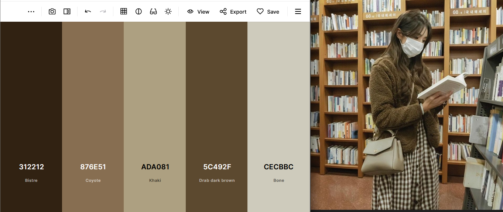

# Colors API - create color palette from images



The image above is an example of usage for the application.
And this is how the output looks like:

```json
{
  "palette": [
    "#312212",
    "#876E51",
    "#ADA081",
    "#5C492F",
    "#CECBBC"
  ]
}
```

## How to run

I'm using `poetry` as package manager for this application.

### Running with Docker

Run the command:

```shell
docker compose up -d --build
```

<details>
  <summary>Running manually</summary>

1) first install the dependencies

    ```shell
    poetry install
    ```

2) then run the project in `poetry shell`:

    ```shell
    uvicorn --reload colors_api.api:app --port 10001
    ```
</details>

## Endpoints

Once the application is running, you can browse to
`http://localhost:10001/docs` and learn more about the endpoints.

Until now, we have:

- /healthcheck - checks if the API is running
- /colors?n_colors - extract a given number of colors from a
given image and return a list of hex colors.

## What I studied/learned with this project

- [x] TDD
- [x] FastAPI
- [x] Color segmentation with OpenCV and the *Kmeans algorithm*
- [x] Image upload

### For future versions

Features I want to implement:

- [ ] User authentication
- [ ] Request rate limits
- [ ] Database integration
- [ ] Metadata collection
- [ ] Limit image size
- [ ] To have a different endpoint for really large images (async)
